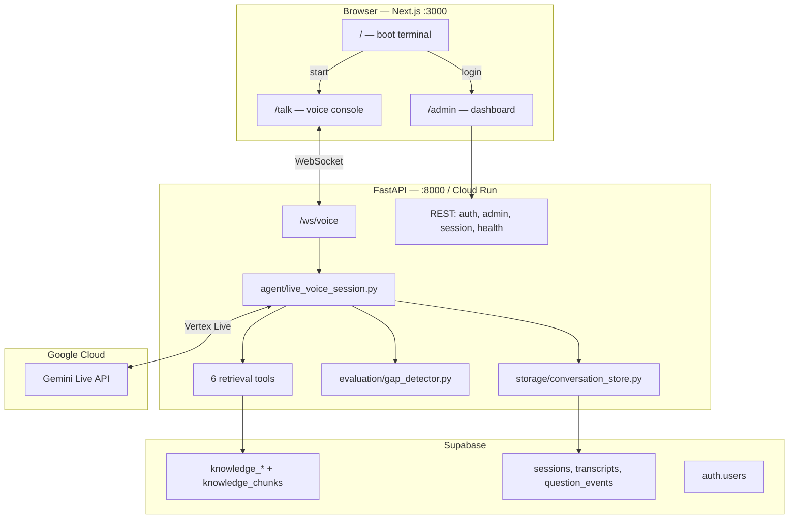
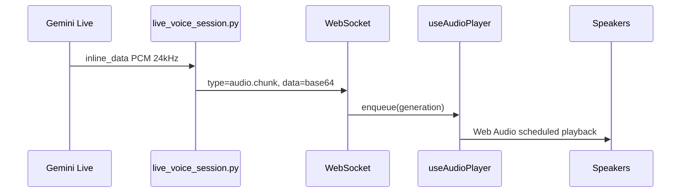
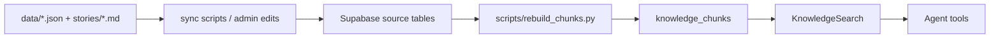

# Talk with Nikhil — Project Overview (Low-Level)

> **For humans and AI assistants:** Read this file first when you need how the app works end-to-end (audio flow, frontend/backend split, WebSockets, Supabase). Detailed schema and deployment notes live in [architecture.md](./architecture.md) and [deployment.md](./deployment.md).

## What this project is

A **terminal-style AI portfolio**: visitors type `start`, enter a **live voice conversation** with an AI version of Nikhil, powered by **Gemini Live (native audio)** + **Supabase knowledge** + an **admin loop** to fix weak answers.

| Layer | Stack |
|--------|------|
| Frontend | Next.js 15, React, TypeScript, Zustand, Web Audio API, Tailwind |
| Backend | Python 3.11+, FastAPI, Google GenAI SDK (Vertex AI) |
| Voice model | `gemini-live-2.5-flash-native-audio` |
| Database | Supabase (Postgres, RLS, Auth) |
| Deploy | Vercel (frontend), Google Cloud Run (backend) |

---

## System diagram



---

## User-facing routes

| Route | Purpose |
|-------|---------|
| `/` | Boot terminal. Commands: `start` → `/talk`, `game` → `/game`, `login` → `/admin` |
| `/talk` | **Primary product** — live voice session (auto-starts on mount) |
| `/admin` | Dashboard (sessions, flagged questions, profile) |
| `/game` | Dino runner easter egg |

**Client state:** Zustand in `frontend/lib/store.ts` — session phase, speaker, transcript, topic/project context.

---

## Two WebSocket endpoints (do not confuse them)

| Endpoint | Hook / client | Purpose |
|----------|----------------|---------|
| **`/ws/voice`** | `useVoiceSession` | **Primary path.** Bidirectional **PCM audio** + transcripts + barge-in. Used by `/talk`. |
| **`/ws/live`** | `useLiveSession` + `LiveSocket` | Text-only live session (transcripts, speaker states). **No raw audio.** Alternate/legacy path. |

Env vars (frontend):

- `NEXT_PUBLIC_WS_VOICE_URL` → `ws://localhost:8000/ws/voice` (production: `wss://…/ws/voice`)
- `NEXT_PUBLIC_WS_URL` → `/ws/live`
- `NEXT_PUBLIC_API_BASE_URL` → REST base for admin/auth

---

## Audio flow (mic → AI → speakers)

### 1. Mic → backend (16 kHz PCM)

```mermaid
sequenceDiagram
  participant Mic as Browser mic
  participant AW as AudioWorklet
  participant WS as WebSocket /ws/voice
  participant BE as live_voice_session.py
  participant GL as Gemini Live

  Mic->>AW: Float32 (device rate, often 48kHz)
  AW->>AW: Int16 PCM in audio-processor.js
  Note over AW: useVoiceSession resamples to 16kHz
  AW->>WS: JSON type=audio.chunk, data=base64
  WS->>BE: receive_json
  BE->>GL: audio/pcm;rate=16000
```

**Frontend (`frontend/hooks/useVoiceSession.ts`):**

1. `getUserMedia()` — mono, echo cancellation, noise suppression.
2. `AudioContext` + `public/audio-processor.js` worklet → Int16 PCM.
3. Resample to **16 kHz** if device rate differs.
4. Base64 → `{ type: "audio.chunk", data }` over WebSocket.

**Backend (`backend/agent/live_voice_session.py` → `reader()`):**

- Decode base64 → send `LiveClientRealtimeInput` with `mime_type="audio/pcm;rate=16000"`.

### 2. Backend → speakers (24 kHz PCM)



**Backend (`writer()`):**

- Audio from `model_turn.parts[].inline_data` → `{ type: "audio.chunk", data, sample_rate: 24000 }`.
- Transcripts: `transcript.final` / partial from input/output transcription.

**Frontend (`frontend/hooks/useAudioPlayer.ts`):**

- `AudioContext` at **24 kHz**.
- Int16 → `AudioBuffer`, schedule chunks sequentially.
- **Barge-in:** stale chunks dropped via `generationRef` (see below).

### 3. Barge-in (interrupt)

| Step | Location |
|------|----------|
| User speaks while AI talks | Gemini sets `server_content.interrupted` |
| Backend | `forwarding_suppressed = true`, send `{ type: "interrupted" }`, stop forwarding tail audio |
| Frontend | `flushAudio()` — bump generation, silence gain, discard queued stale `audio.chunk` |

### 4. Text during voice session

`TextInput` → `{ type: "transcript.user", content }` → backend sends text turn to Gemini (same `/ws/voice` connection).

### Audio formats (reference)

| Direction | Format |
|-----------|--------|
| Browser → backend | PCM16, 16 kHz, mono, base64 in JSON |
| Backend → browser | PCM16, 24 kHz, mono, base64 in JSON |
| Backend → Gemini | `audio/pcm;rate=16000` |
| Gemini → backend | Raw PCM in `inline_data` |

---

## Backend module map

| File / area | Role |
|-------------|------|
| `backend/main.py` | FastAPI app, CORS, router mounts |
| `backend/routes/voice_websocket.py` | `GET /ws/voice` → `handle_voice_session` |
| `backend/routes/websocket.py` | `GET /ws/live` (text-only) |
| `backend/agent/live_voice_session.py` | **Core bridge:** client WS ↔ Gemini Live, tools, persistence |
| `backend/agent/live_session.py` | Text-only live session manager |
| `backend/agent/instructions.py` + `prompts/persona.md` | System instruction |
| `backend/agent/tools/*` | Function-calling into Supabase |
| `backend/retrieval/search.py` | `KnowledgeSearch` on `knowledge_chunks` |
| `backend/retrieval/chunk_builder.py` | Rebuild index from source tables |
| `backend/storage/conversation_store.py` | Sessions, transcripts, question_events |
| `backend/evaluation/gap_detector.py` | Flags weak answers after each AI turn |
| `backend/routes/admin.py`, `auth.py` | Admin API + Supabase Auth JWT |

### Gemini tools (voice session)

- `search_about_nikhil`
- `get_project_details`
- `get_experience_details`
- `get_timeline_event`
- `get_links`
- `get_preferences`

Tool results return via `LiveClientToolResponse`; retrieval context is tracked for gap detection.

---

## Knowledge / RAG



- **Source tables:** `profiles`, `experiences`, `projects`, `faqs`, `timeline_events`, `stories`, `links`, `preferences`
- **Index:** `knowledge_chunks` (pg_trgm keyword search; pgvector ready)
- **Learning loop:** weak answer → `question_events` → admin resolve → `knowledge_updates` → rebuild chunks

---

## Persistence (per voice session)

1. **`sessions`** — created on connect, closed on disconnect.
2. **`transcript_messages`** — user + AI text (from transcription or typed input).
3. **`question_events`** — gap detector output after each AI turn.

---

## Admin flow

1. User types `login` on home → `/admin`.
2. `POST /api/auth/login` → Supabase Auth → JWT in Zustand (`frontend/lib/auth-store.ts`).
3. Dashboard tabs: Overview, Sessions, Flagged, Profile.
4. Protected: `Authorization: Bearer <token>` on `/api/admin/*`.

---

## Frontend file map

| Concern | Paths |
|---------|--------|
| Pages | `frontend/app/page.tsx`, `talk/page.tsx`, `admin/page.tsx`, `game/page.tsx` |
| Voice UI | `VoiceCore`, `TranscriptConsole`, `CallControls`, `AudioVisualizer` |
| Hooks | `useVoiceSession`, `useAudioPlayer`, `useLiveSession`, `useMicInput`, `useAudioAnalyzer` |
| Wiring | `lib/constants.ts`, `lib/store.ts`, `lib/api.ts`, `public/audio-processor.js` |

---

## Environment variables (prod checklist)

**Frontend (Vercel):**

- `NEXT_PUBLIC_API_BASE_URL`
- `NEXT_PUBLIC_WS_VOICE_URL` (must be `wss://` in prod)
- `NEXT_PUBLIC_WS_URL` (if using text live path)

**Backend (Cloud Run):**

- `SUPABASE_URL`, `SUPABASE_ANON_KEY`, `SUPABASE_SERVICE_ROLE_KEY`
- `GOOGLE_CLOUD_PROJECT`, `GOOGLE_CLOUD_LOCATION`, `GOOGLE_GENAI_USE_VERTEXAI=TRUE`
- `GEMINI_VOICE_MODEL=gemini-live-2.5-flash-native-audio`
- `ALLOWED_ORIGIN` (comma-separated: prod + preview URLs)

Voice in prod requires **Vertex AI** credentials on the backend service account.

---

## TL;DR — one voice turn

1. User speaks → mic → 16k PCM chunks → `/ws/voice`.
2. Backend forwards to Gemini Live.
3. Gemini may **call tools** → Supabase search → tool response back to model.
4. Gemini streams **24k PCM** + transcripts → backend → browser.
5. `useAudioPlayer` plays audio; UI updates transcript + speaker state.
6. On turn complete: save transcript, run **gap detector**, maybe flag for admin.
7. If user interrupts: `interrupted` event → flush audio on client, suppress tail on server.

---

## Related docs

- [knowledge-organization.md](./knowledge-organization.md) — how LinkedIn / recent activity maps to Supabase (types, disambiguation)
- [architecture.md](./architecture.md) — schema, layers, V2 roadmap, mermaid system diagram
- [deployment.md](./deployment.md) — deploy steps
- [README.md](../README.md) — quick start and project tree

## Keeping knowledge current (LinkedIn → AI)

See **[knowledge-organization.md](./knowledge-organization.md)** for types and workflow.

1. Curate posts in `data/updates.json` (typed entries + `agent_guidance`).
2. Run **`make sync-knowledge`** (sync + rebuild chunks).

## Keepalive cron (Supabase pause prevention)

Vercel runs **`GET /api/cron/keepalive` daily** — direct Supabase ping + backend `/readiness`. See [deployment.md](./deployment.md#5-keepalive-cron-prevents-supabase-auto-pause).
